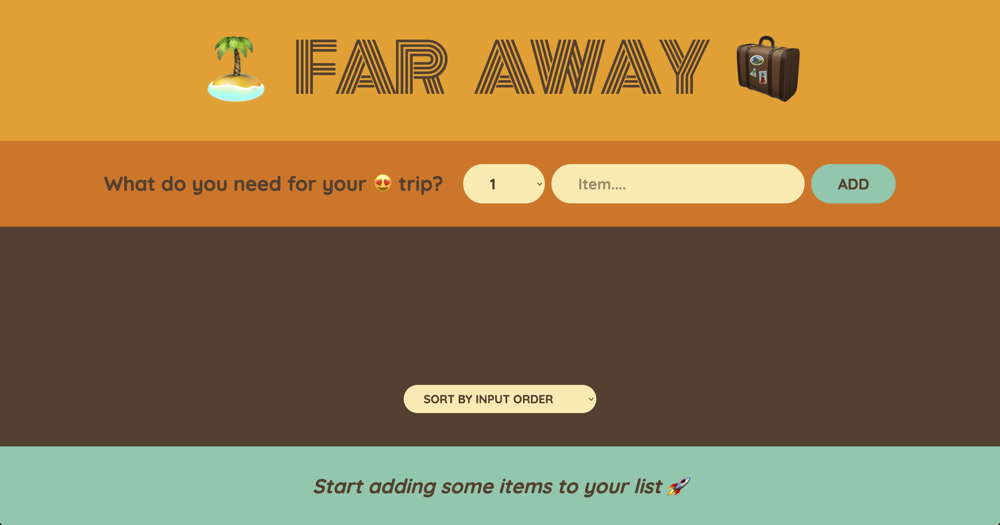
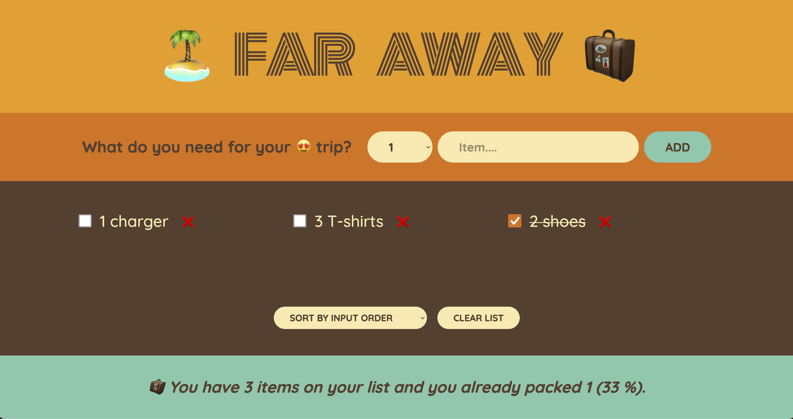
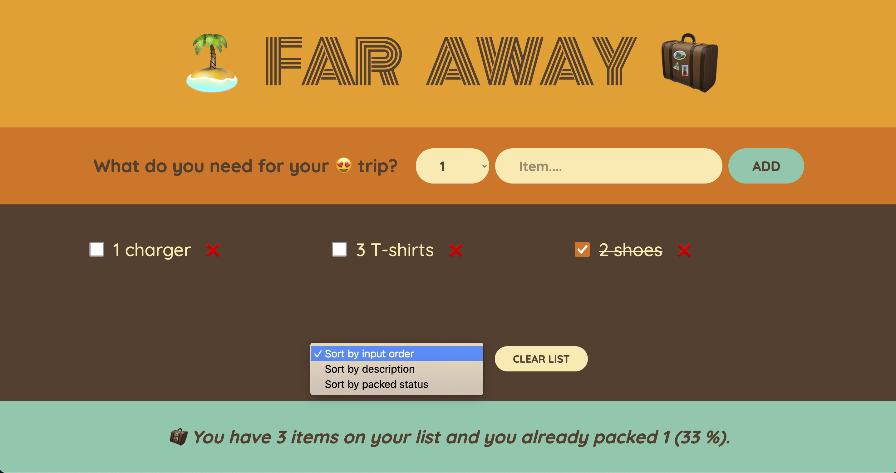
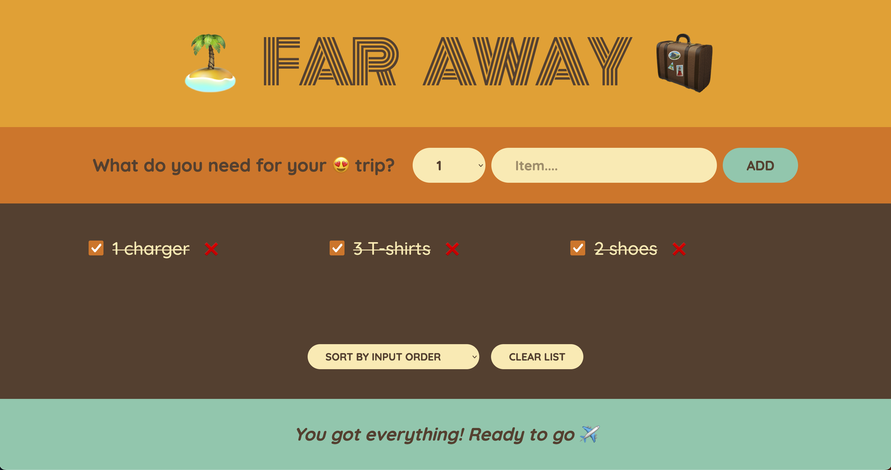
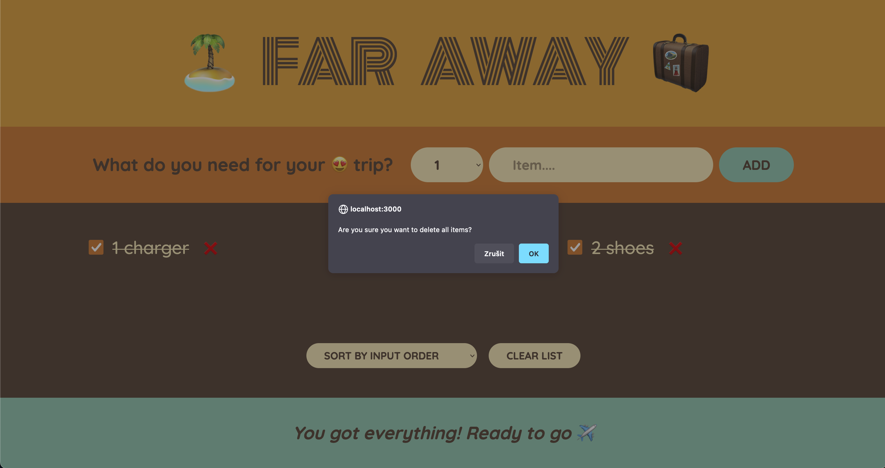

# Getting Started with Create React App

This project was bootstrapped with [Create React App](https://github.com/facebook/create-react-app).

## App information

This single-page web app serves as a packing list for travellers 🌍

### Essential functionality:
 - add amount & item description to the list
 - sort the list by default sorting options
 - mark an item as packed
 - clear list 

## App views:
### Default view

### Added items to the list

### Sorting options

### All items packed

### Clear list
