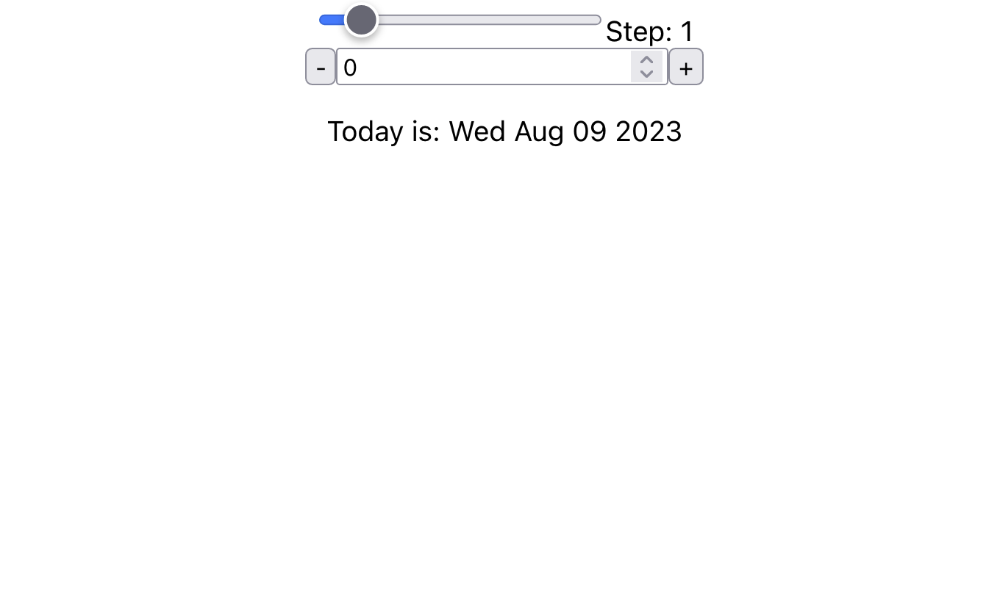
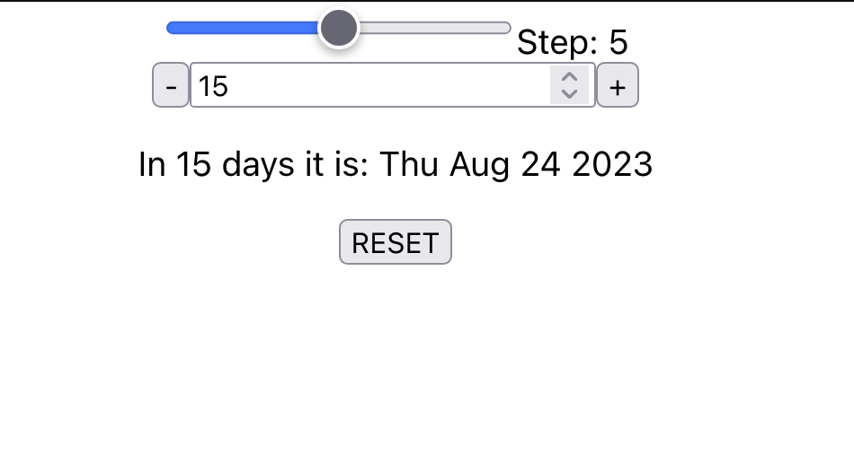

# Getting Started with Create React App

This simple app displays a screen with options to determine a date in the past and in the future.

Options: 
 - Step: determines how many days is added to the counter below by one click (0 - 10)
 - Counter enables user to set number of days: 
   - manually
   - via input box arrows (add or remove 1)
   - via + and - buttons (`* step`)
 - RESET: enables user to reset the view to default

## Default view

## Customized view

