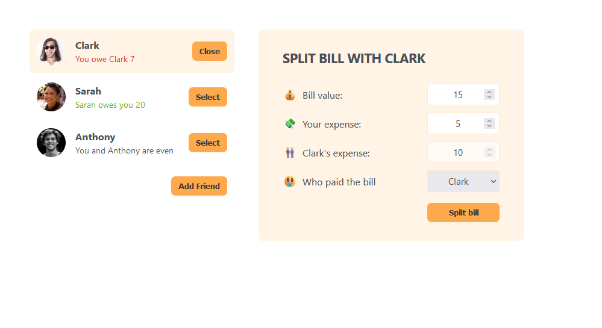
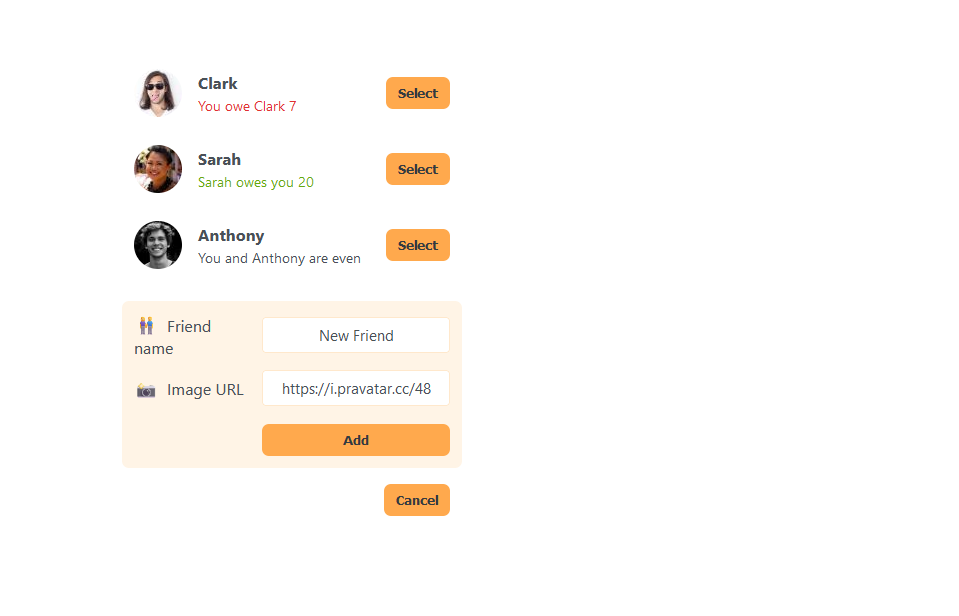

# Getting Started with Create React App

This project was bootstrapped with [Create React App](https://github.com/facebook/create-react-app).

## Eat 'n Split

This app serves as a tool for splipting the bill between friends. 
It's possible to add new friends or update existing financial balance.
### Updating balance/splitting the bill

### Add new friend functionality
